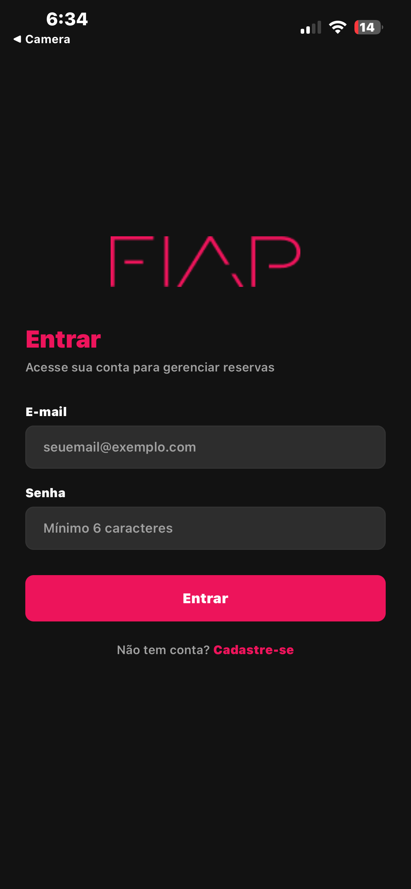
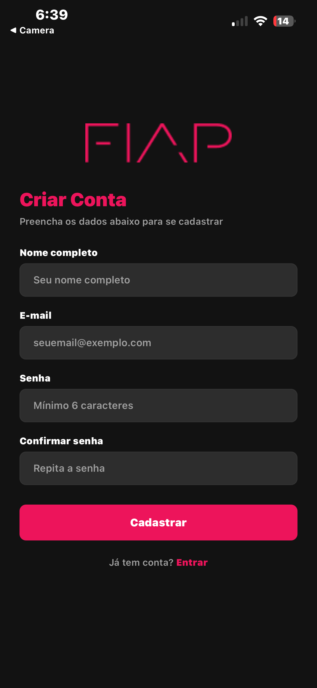
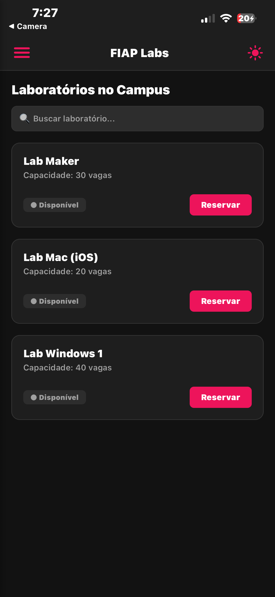
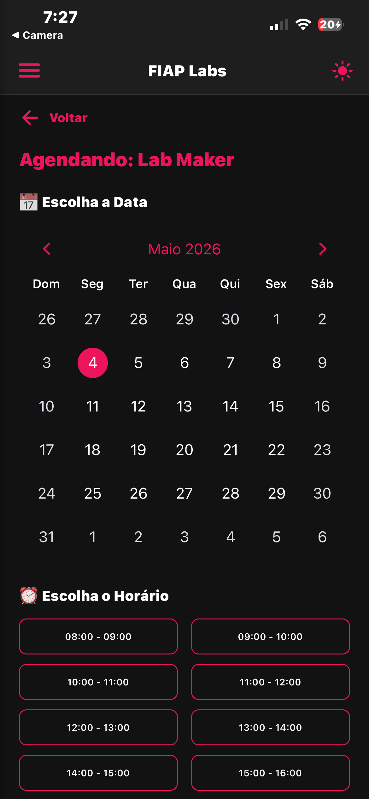
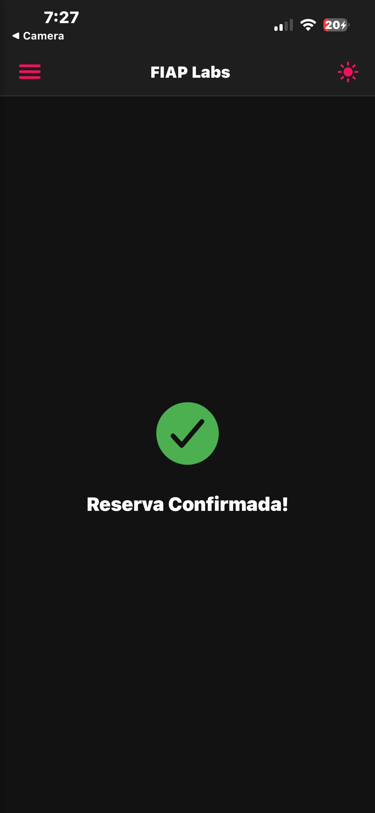
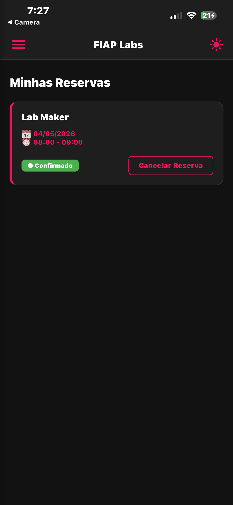
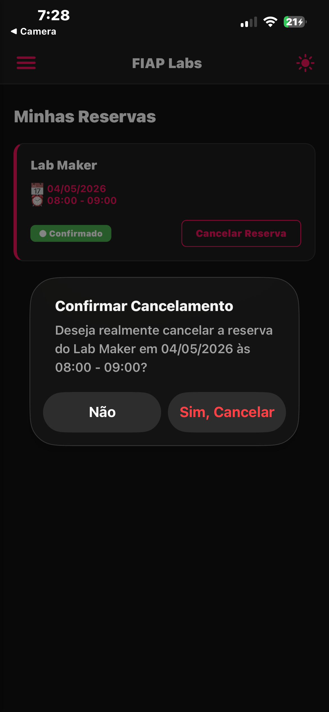
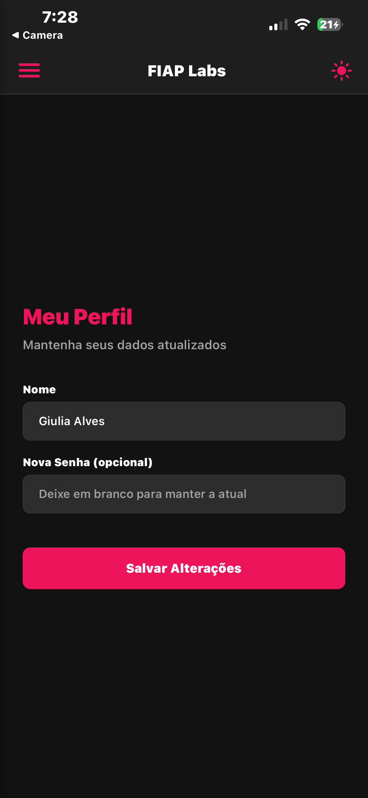
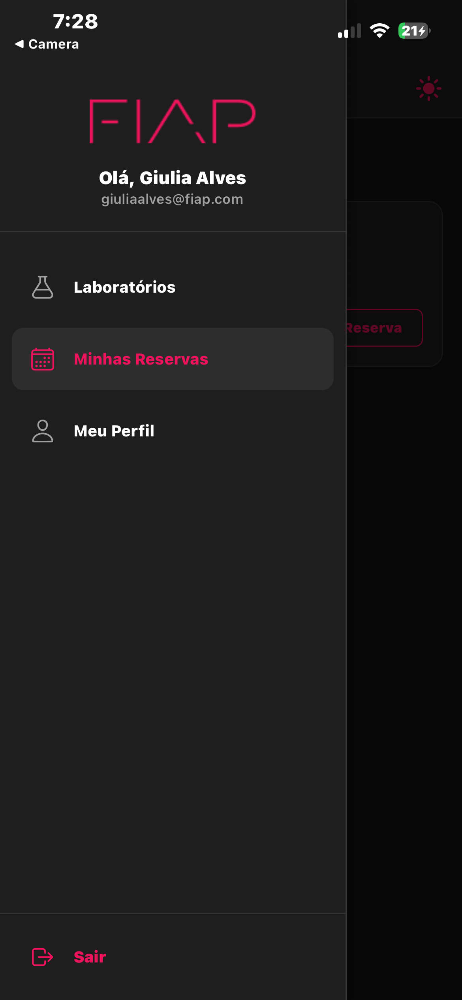

# FIAP Labs - Gerenciamento de Reservas

## 📌 Sobre o Projeto
O **FIAP Labs** é um aplicativo mobile desenvolvido para facilitar o agendamento e gerenciamento de laboratórios pelos alunos da FIAP. O app resolve o problema de falta de visibilidade sobre a disponibilidade dos laboratórios e simplifica o processo de reserva.

**Operação FIAP Escolhida:** Gestão de Espaços e Laboratórios do Campus. Escolhemos esta operação por ser uma dor real dos alunos que precisam de espaços equipados para projetos e estudos.

### O que mudou em relação ao CP1:
- **Autenticação Real:** Implementação de cadastro e login com persistência via AsyncStorage.
- **Gerenciamento de Estado Global:** Migração para Context API para gerenciar autenticação, reservas e temas.
- **Persistência de Dados:** Todos os agendamentos e dados de usuário sobrevivem ao fechamento do app.
- **Interface Refinada:** Implementação de Modo Escuro, animações na sidebar e feedbacks visuais detalhados.
- **Segurança:** Proteção de rotas para garantir que apenas usuários logados acessem as funcionalidades principais.

---

## 👥 Integrantes do Grupo
- **Giulia Rocha** - RM: 558084
- **Gabriel Danius** - RM 555747
- **Caio Rossini** - RM 555084
- **Carlos Eduardo** - RM 556785

---

## 🚀 Como Rodar o Projeto

### Pré-requisitos
- Node.js instalado
- Expo Go instalado no smartphone ou emulador configurado
- Versão do Expo SDK: 50+

### Passo a Passo
```bash
# 1. Clone o repositório
git clone https://github.com/Giulia-Rocha/fiap-mdi-cp2-fiap-labs

# 2. Acesse a pasta
cd fiap-mdi-cp2-fiap-labs

# 3. Instale as dependências
npm install

# 4. Inicie o projeto
npx expo start
```
Após iniciar, leia o QR Code com o app Expo Go ou pressione `a` para Android / `i` para iOS.

---

## 📸 Demonstração Visual

### Prints das Telas

| Tela | Visualização | Tela | Visualização |
| :--- | :---: | :--- | :---: |
| **Login** |  | **Cadastro** |  |
| **Lista de Labs** |  | **Agendamento** |  |
| **Reserva Confirmada** |  | **Minhas Reservas** |  |
| **Cancelar Reserva** |  | **Meu Perfil** |  |
| **Sidebar (Menu)** |  | | |

### 🎥 Vídeo de Demonstração
[Clique aqui para assistir ao vídeo do fluxo completo](https://drive.google.com/file/d/1_dB5F9dHbt60k3wZyzndrZYQv8XRs4FR/view?usp=sharing)

---

## 🛠️ Decisões Técnicas

- **Estrutura de Pastas:** Seguimos o padrão sugerido pelo Expo Router (`app/`, `components/`, `context/`, `assets/`), separando rotas autenticadas `(app)` de rotas de autenticação `(auth)`.
- **Context API:** 
  - `AuthContext`: Gerencia o estado do usuário, login, cadastro, logout e persistência da sessão.
  - `ReservaContext`: Gerencia os laboratórios disponíveis e as reservas do usuário com persistência local.
  - `ThemeContext`: Controla a alternância entre modo claro e escuro.
- **Autenticação:** Implementada do zero usando `AsyncStorage` para armazenar uma lista de usuários e a sessão ativa.
- **Proteção de Rotas:** Utilizamos um `Layout` protegido que verifica o `usuarioLogado` antes de renderizar qualquer conteúdo da pasta `(app)`.
- **Validação de Formulários:** Todas as validações são feitas via estado (`useState`) com mensagens de erro inline abaixo dos campos, garantindo uma UX fluida.

---

## ⭐ Diferenciais Implementados

### 1. Modo Escuro / Tema Dinâmico
- **Justificativa:** Proporciona conforto visual ao usuário em diferentes ambientes e é uma funcionalidade padrão em apps modernos.
- **Implementação:** Criamos um `ThemeContext` que injeta cores dinâmicas em todos os componentes através de um hook `useTheme`. A preferência do usuário é salva no `AsyncStorage`.

### 2. Busca e Filtragem em Tempo Real
- **Justificativa:** Facilita a localização de laboratórios específicos em uma lista que pode crescer, melhorando a usabilidade.
- **Implementação:** Implementamos um filtro dinâmico na `FlatList` de laboratórios que reage instantaneamente ao que o usuário digita.

### 3. Animações com Animated API
- **Justificativa:** Melhora a percepção de qualidade do app com transições suaves.
- **Implementação:** A Sidebar (Menu Lateral) foi construída usando a `Animated API` nativa para garantir performance e fluidez na abertura e fechamento.

---

## 🔮 Próximos Passos
- Integração com API real (Backend).
- Implementação de notificações Push para lembrar o usuário do horário da reserva.
- Possibilidade de escolher o assento no laboratório.
